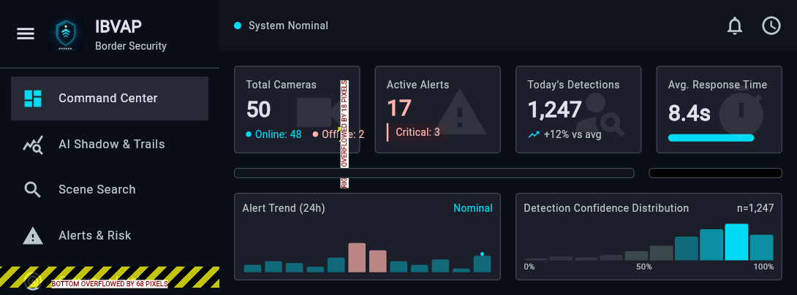
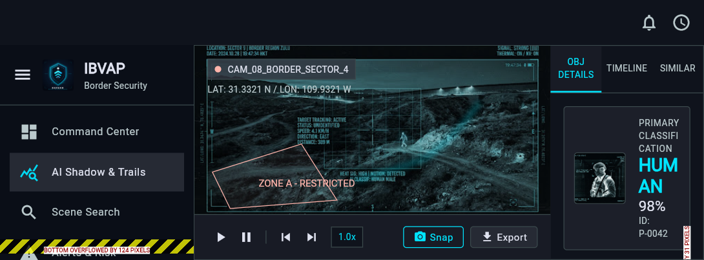

# KAVACH

KAVACH is a Flutter-based border security operations dashboard for monitoring cameras, alerts, detections, coverage, and system administration from one interface.

## Preview

### Command Center



### AI Shadow & Trails



## Capabilities

- Command Center with camera, alert, detection, and response metrics
- AI Shadow & Trails investigation view
- Scene Search for intelligence lookup workflows
- Alerts & Risk monitoring
- Coverage Intel for operational visibility
- System Admin controls for cameras, users, and configuration
- Responsive Flutter web interface with a shared KAVACH brand system

## Tech Stack

- Flutter and Dart
- Material 3 widgets
- Flutter Web deployment
- Vercel static hosting

## Run Locally

Install Flutter, then run:

```bash
flutter pub get
flutter run
```

To run the web version on a local server:

```bash
flutter run -d web-server --web-port 8080
```

Open `http://localhost:8080` in a browser.

## Build For Web

```bash
flutter build web --release
```

The production output is generated in `build/web`.
